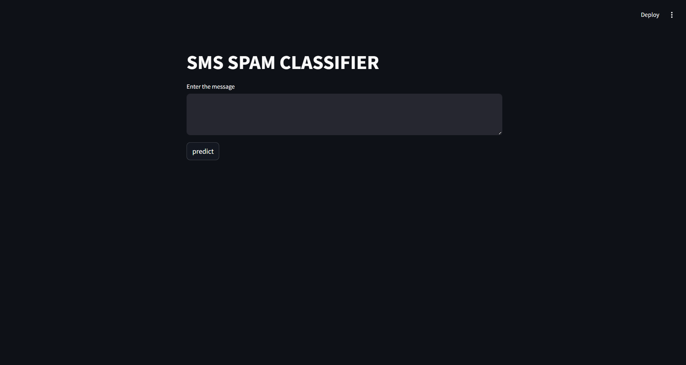
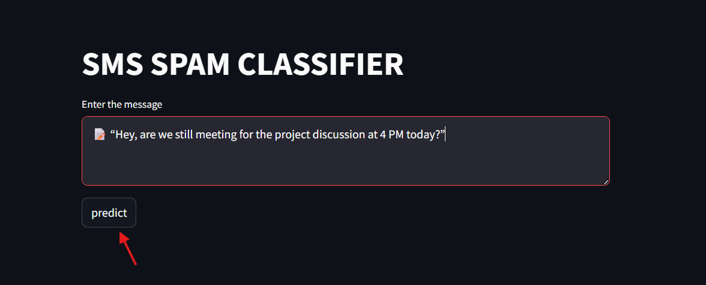
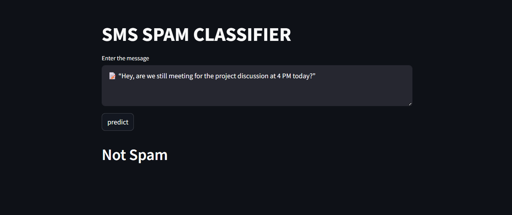
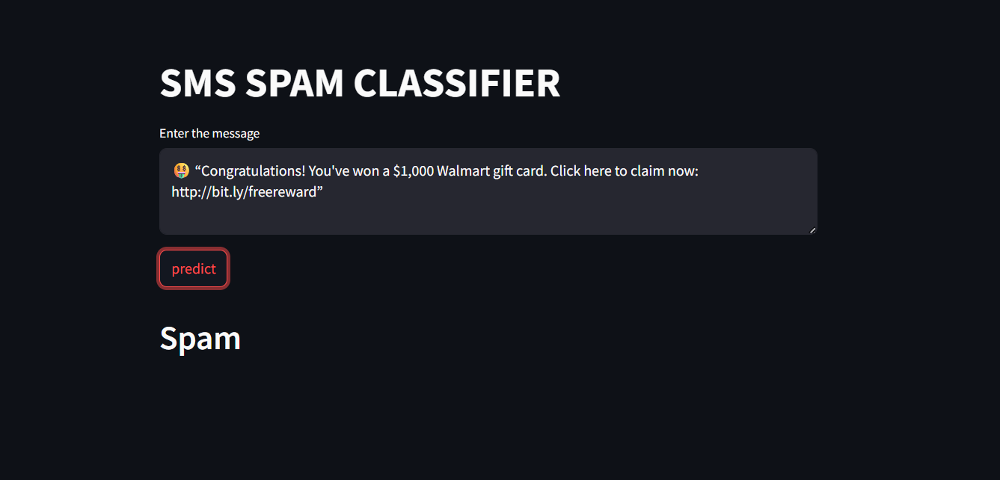

# 📩 Spam Detection Web App

This project is a **machine learning-based web application** that detects whether a given SMS or email message is spam or not. It uses various classification algorithms and provides a clean, user-friendly interface built with **Streamlit** for real-time message prediction.

---

## 🚀 Features

- ✅ Clean and interactive web interface built using Streamlit  
- ✅ Real-time spam classification based on user input  
- ✅ Advanced text preprocessing (tokenization, stopword removal, stemming)  
- ✅ TF-IDF vectorizer for numerical feature representation  
- ✅ Trained and evaluated multiple ML algorithms  
- ✅ Visual walkthrough of UI included  

---

## 🤖 Algorithm Performance

The following machine learning models were trained and evaluated. Results are based on test set accuracy and precision:

| S.No | Algorithm                       | Accuracy  | Precision |
|------|----------------------------------|-----------|-----------|
| 1    | K-Nearest Neighbors (KN)         | 0.905     | 1.000     |
| 2    | Naive Bayes (NB)                 | 0.971     | 1.000     |
| 3    | Random Forest (RF)               | 0.976     | 0.983     |
| 4    | Support Vector Classifier (SVC)  | 0.976     | 0.975     |
| 5    | Extra Trees Classifier (ETC)     | 0.975     | 0.975     |
| 6    | Logistic Regression (LR)         | 0.958     | 0.970     |
| 7    | AdaBoost                         | 0.960     | 0.929     |
| 8    | XGBoost (XGB)                    | 0.967     | 0.926     |
| 9    | Gradient Boosting (GBDT)         | 0.947     | 0.919     |
| 10   | Bagging Classifier (BgC)         | 0.958     | 0.868     |
| 11   | Decision Tree (DT)               | 0.932     | 0.833     |

> ✅ **Best Accuracy**: Random Forest, SVC  
> 💯 **Perfect Precision**: Naive Bayes  

---

## 🧪 Dataset

- **Source**: [Kaggle - SMS Spam Collection Dataset](https://www.kaggle.com/datasets/uciml/sms-spam-collection-dataset)
- **Total Records**: 5,572 messages  
- **Labels**: `ham` (not spam), `spam`

---

## 🧠 Message Classification Pipeline

1. User inputs message
2. Text preprocessing:
   - Lowercasing
   - Tokenization
   - Stopword & punctuation removal
   - Stemming
3. TF-IDF vectorization
4. ML model prediction
5. Display: Spam or Not Spam

---

## 🖥️ Streamlit Web App Demo

A visual walkthrough of the interface and its usage:

### 🧾 1. Enter a Message

📥 Paste or type any SMS/email content.

> Example: *"Claim your free iPhone now!"*

---

### 🔘 2. Click the "Predict" Button

🚀 Triggers the preprocessing and classification pipeline.

> Internally, it transforms the message and feeds it to the trained model.

---

### 📍 3. Get Prediction Result

#### ✅ Not Spam:

#### 🚫 Spam:

> Prediction is shown clearly using `st.header()` output.

---

## 🗂️ File Structure

